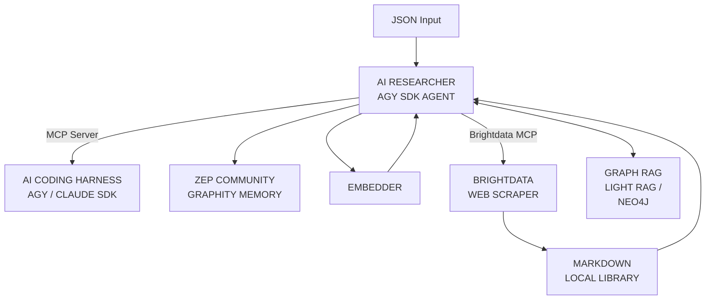

# AI Researcher Deep Agent Implementation Plan

This plan outlines the construction of a personal AI Document Library Researcher, utilizing the Google Antigravity SDK to process markdown documents from various frameworks and project memories into a Neo4j vector/graph store, coupled with a Zep Graphiti memory system. 

**Deployment Context:** The system is designed to run exclusively locally within a Python `venv` on a PC laptop. It will not be deployed to a web server or any external environment.
**Primary Purpose:** To serve as a validation and correction engine. It communicates via the Model Context Protocol (MCP) to a primary agent coding harness (e.g., Antigravity SDK, GitHub Copilot) to evaluate, validate, and provide structural/coding corrections to the coding agent.

## Proposed Workflow Architecture

## Proposed Changes

### 1. Document Ingestion & Scraping Pipeline
- **Brightdata MCP Scraping**: Integrate the Brightdata MCP server to allow the agent to scrape public URLs, documentation, and frameworks directly into clean, LLM-optimized Markdown files. These files will be stored in the local library.
- **Local Library Configuration**: On startup, the program will prompt the user for the absolute path to their local library of documents, or default to a designated folder within the same installation directory.
- **Markdown Parser & Embedder**: Read, chunk, and process `md` files from this designated local coding experience library using Antigravity's native integration.
- **Graphiti Ingestion & Tracking**: The processed documents are sent to **Graphiti**, which automatically extracts temporal nodes and edges, generates embeddings, and handles ingestion into the Neo4j vectorbase to build out the agent's long-term memory.

### 2. Neo4j & Graphiti Integration
- **SDK Installation**: Ensure `graphiti-core`, `neo4j`, and `mcp` SDKs are strictly installed in the Python `venv`.
- **Graphiti Initialization**: Instantiate the `Graphiti(neo4j_uri, user, password)` client. Graphiti handles the bi-temporal data model and semantic retrieval under the hood.
- **Schema Setup**: While Graphiti handles node and edge extraction dynamically, we will implement explicit schema validation to ensure the Neo4j vector index is properly configured for the embeddings.
- **Experience Tracking**: Route "past resolves" and user interactions into Graphiti's temporal knowledge graph to maintain a cohesive experience memory across sessions.

### 4. Agent Orchestration (Antigravity SDK)
- Build the `AI Researcher Deep Agent` natively utilizing the `google-antigravity` package.
- Define the agent's capabilities as tools (parsing, searching Neo4j, querying Zep).

### 5. MCP Integration & Validation Engine
- Use the standard Python MCP SDK (or FastMCP) to expose the agent as a local **MCP Server**.
- The main coding harness (AGY SDK, Copilot, Claude Desktop) acts as the MCP Client.
- The AI Researcher exposes tools and prompts over MCP specifically designed to ingest proposed code, validate it against the Neo4j/Zep knowledge base, and return structural or coding corrections to the primary agent.

### 6. Development Workflow (agents-cli)
- **Scaffold & Initialization**: Utilize `agents-cli scaffold` to set up the robust project structure and configuration necessary for the AI Researcher agent, ensuring it aligns with AGY SDK best practices.
- **Continuous Evaluation**: Leverage `agents-cli eval` to rigorously test the agent's validation and correction outputs against a suite of known, problematic code snippets. This ensures the AI Researcher acts as a "solid agent" that provides highly accurate and reliable corrections.
- **Workflow Automation**: Use the `agents-cli` workflow tools to streamline the local build, test, and run cycle, enabling fast iteration as the agent's knowledge base and correction capabilities evolve.

## Verification Plan

### Automated Tests
- `pytest` for testing the Markdown parser and chunking logic.
- Mock Neo4j and Zep endpoints to verify the agent's tool execution.

### Manual Verification
- Run the agent locally and connect to it using the Antigravity SDK as an MCP Client.
- Send a complex query that requires checking both the markdown repository and Zep memory.
- Verify that the responses use the Neo4j Graph RAG correctly.
